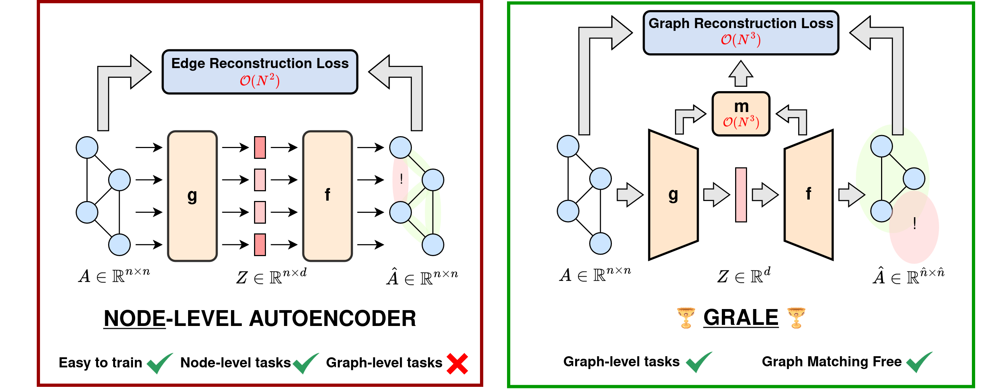

# GRALE: Graph-Level Autoencoder

[](https://arxiv.org/abs/2505.22109)
[](https://huggingface.co/PaulKrzakala/GRALE-128-32)
[](https://neurips.cc/virtual/2025/loc/san-diego/poster/117714)



## Overview

GRALE is a novel graph autoencoder that encodes and decodes graphs of varying sizes into a shared embedding space. Built on an Evoformer-based attention architecture (AlphaFold's core component), GRALE uses an Optimal Transport-inspired loss and differentiable node matching to enable general pre-training for diverse downstream tasks—from classification and regression to graph interpolation, editing, matching, and prediction.

## Quick Start

```python
from GRALE.main import GRALE_model
from huggingface_hub import hf_hub_download

# Load pretrained model
checkpoint = hf_hub_download(repo_id="PaulKrzakala/GRALE-128-32", filename="last.ckpt")
model = GRALE_model.load_from_checkpoint(checkpoint)

# Encode and decode graphs
embeddings = model.encode(graph_data)
reconstructed = model.decode(embeddings)
```

See [demo.ipynb](demo.ipynb) for full examples.

## Resources

- [Paper](https://arxiv.org/abs/2505.22109)
- [NeurIPS 2025 Poster](https://neurips.cc/media/PosterPDFs/NeurIPS%202025/117714.png?t=1762354008.229878)
- [Slides](https://neurips.cc/media/neurips-2025/Slides/117714.pdf)

## Installation

```bash
# Python Version: 3.11.14
# Clone the repo
git clone https://github.com/KrzakalaPaul/GRALE.git
cd GRALE

# Create your environment
python3 -m venv .venv
source .venv/bin/activate

# Install dependencies
pip install -r requirements.txt
```

## Citation

```bibtex
@article{krzakala2025quest,
  title={The quest for the GRAph Level autoEncoder (GRALE)},
  author={Krzakala, Paul and Melo, Gabriel and Laclau, Charlotte and d'Alch{\'e}-Buc, Florence and Flamary, R{\'e}mi},
  journal={arXiv preprint arXiv:2505.22109},
  year={2025}
}
```